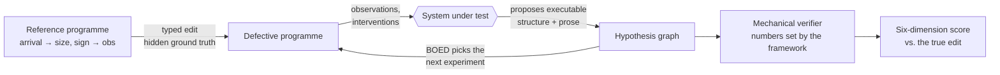

# sciagent

**Can an LLM do science when the right answer isn't in its vocabulary?**
A benchmark that measures it and never takes the model's word for it.

[](pyproject.toml)
[](pyproject.toml)
[](pyproject.toml)
[](docs/SPEC.md)
[](#engineering)
[](LICENSE)

Most "AI scientist" evaluations grade a system against a label or a human
rubric. sciagent grades it against **the exact structural change that was made
to the world**.

Every environment is an executable generative programme. A scenario applies a
typed edit to that programme: a new causal dependency, a hidden latent regime,
a changed distribution family. The system under test has to work out which edit
was made. It does this by running experiments, maintaining a hypothesis graph
and proposing executable structure. Its diagnosis is then scored as a
**distance in edit space**, and in five other ways besides. Nobody writes the
answer key; the answer is the edit.

> **The research question.** Suppose conventional statistics has already
> detected that the current model space is inadequate. Does an LLM-guided system
> then propose useful executable structure *more effectively* than retrieval,
> symbolic search and fixed-expansion baselines?

---

## Headline result

We ran the full preregistered experiment matrix, 1,120 investigations across
seven systems and twelve scenarios, with Claude as the proposer. It produced
three findings. The third is the one we did not expect.

**1. Detection works.** When the truth lies outside the model library (scenario
S11), the posterior-predictive probe flags inadequacy on **85%** of runs.
Its pooled false-positive rate on scenarios with nothing to find is **3.1%**
(5/160).

**2. On the preregistered contrast, the LLM system and retrieval tie exactly.**
The contrast asks whether the hybrid LLM system (V7) beats the retrieval
baseline (B4) on intervention-response similarity. Both score **0.6970**, with
a paired difference of **0.0000 [0.0000, 0.0000]**, n = 17. The strict test
(*did any proposal land closer to the truth than the library itself?*) is also
a tie, at 1.0000 each.

**3. The framework then showed that the tie was forced.** A tie that exact is
itself evidence, so we audited it against the recorded campaign. Two separate
walls made scenario S11's second stage **unwinnable for every possible
system**:

- **A vocabulary wall.** The agent's proposal menu cannot express S11's true
  mechanism, a dependency from event *size* to *arrival rate*. That is not a
  judgement call; it follows in closed form from the distance metric. Every
  expressible proposal sits at structural distance ≥ 1.5 from the truth, while
  the always-entertained null sits at 1.0, so no proposer can ever beat the
  library. The truth itself is reachable at 0.571 through the environment's
  full grammar. It is simply not reachable through the agent's.
- **An evidence wall.** The one diagnostic that carries S11's signature
  (`size_gap_correlation`) was *available* in all 112 recorded LLM briefs and
  *observed* in none of them. Bayesian experimental design selects experiments
  by information gain over the hypotheses currently entertained, and no
  entertained hypothesis made that query informative. So the model never saw
  the one number that pointed at the answer.

The LLM behaved sensibly within both walls. Its 112 proposals were coherent
regime-switching, Hawkes-variant and size-mixture structures, each with a sound
diagnostic rationale. It reasoned well over evidence that never contained the
signature, in a vocabulary that could not state the answer.

**What that means.** The research question is **open, not answered "no"**.
Most benchmarks would have reported "LLM ≈ retrieval" and stopped. Here the
evaluation apparatus is strict enough to show when an instrument cannot tell
two systems apart. That is only possible because ground truth is a structure
rather than a label, and every number is recomputable from a content-addressed
ledger. This was the third instrument flaw the completed campaign exposed,
each one recorded with its evidence in [`docs/DECISIONS.md`](docs/DECISIONS.md).
The fix, how Stage B extension should widen the proposal space, is scoped in
[`docs/BACKLOG.md`](docs/BACKLOG.md).

---

## How it works



Four ideas carry the design.

**Ground truth is a structure, not a label.** A defect is a `frozenset` of edits
drawn from a versioned `EditGrammar`. "Correct diagnosis" is a distance in edit
space, so partial credit has a precise meaning.

**The prior is derived, not fitted.** `EditGrammar.code_length` is a prefix code
over the edit space. It satisfies Kraft's inequality and is fixed before any
scenario exists. The complexity prior `p(D) ∝ 2^(−L(D))` is a statement about
parsimony that comes from the representation, never from benchmark frequencies.

**Out-of-library is mechanical.** Each environment declares two grammars. A
scenario is out-of-library exactly when its true edit lies in
`edit_grammar() \ agent_grammar()`. No annotator decides it.

**The framework writes numbers; agents write structure.** No code path reachable
from an agent can set a plausibility, a posterior, a metric definition or a
score. This is enforced by runtime assertions. The LLM proposes; the machinery
it cannot touch does all the arithmetic.

### Scored six ways, never collapsed

| | Dimension | What it measures |
|---|---|---|
| D1 | Structural edit recovery | `grammar.distance(proposed, true)` |
| D2 | Held-out predictive adequacy | Posterior predictive score on diagnostics never used in the investigation |
| D3 | Intervention-response similarity | Does the proposal behave like the truth when you *intervene*? |
| D4 | Explanatory coverage | Likelihood gained on previously poorly explained results |
| D5 | Enabled experiment value | Information gain of the best experiment the proposal makes possible |
| D6 | Complexity | `code_length(proposed)` |

A structurally different but interventionally equivalent explanation counts as
a scientific success (D3), not a failure. There is no total and no leaderboard
rank: the six are always reported as a vector.

### Systems compared

| ID | System |
|---|---|
| **V7** | Hybrid: an LLM proposes and revises hypotheses, BOED selects experiments |
| V3 / V4 | LLM with raw history vs. LLM with the hypothesis graph (ablation) |
| V1 | BOED-only over the closed hypothesis set |
| **B4** | Retrieval from a fixed mechanism library, the *preregistered* primary comparator |
| B5 | Symbolic beam search over the agent grammar |
| B1 | PPC-only detector: a floor for detection, proposes nothing |

B4 was chosen in advance as the comparator most likely to *deflate* the LLM
claim.

---

## The environment

`environments/pointproc` is a marked point process with four components
(`arrival → {size, sign} → obs`). Four mechanisms can be edited in, each
calibrated to the same operating point (mean rate 1.0, inter-arrival dispersion
3.5), so that **no single statistic separates them**:

| Mechanism | Edit type | Discriminated by |
|---|---|---|
| Hawkes self-excitation | `AddDependency(arrival → arrival)` | a forced arrival raises the subsequent rate |
| Latent regime switching | `AddLatentVariable(arrival, TwoStateMarkov)` | geometric run lengths; conditioning on the inferred state |
| Deterministic seasonality | `ReparameteriseComponent(arrival, PeriodicRate)` | phase-conditioning removes the overdispersion entirely |
| Independent Poisson mixture | `ChangeDistributionFamily(arrival, MixtureOfPoisson)` | flat Fano profile; no temporal correlation; no response to intervention |

Telling the four apart takes a plan of at least three stages; no single
diagnostic can do it. The confounding is measured rather than asserted
(`scripts/confounding_check.py`). Twelve scenarios sit on this environment, and
two carry the most weight:

- **S11, out of library.** The truth is outside the agent's vocabulary by
  construction.
- **S12, a garden path.** A censoring nuisance makes the first two diagnostics
  point confidently at the wrong mechanism, so the system has to notice and
  revise its plan.

A second environment, `environments/qtm`, ingests a byte-frozen catalogue of
**real Southern California seismicity**. It produces the same event-log
interface, with a declared observation process and a preregistered consensus
edit, so the same framework can run on found data.

---

## Quickstart

```sh
uv sync
uv run pytest -n 4 --dist loadfile
```

Apply a defect to the reference programme, execute it, and measure it in edit
space:

```python
import numpy as np

from environments.pointproc import edit_grammar, mechanism_defect, reference_program
from sciagent.core.types import ComponentId, Seed

program = reference_program()
grammar = edit_grammar()

defect = mechanism_defect("hawkes")
defective = grammar.apply(program, defect)

log = defective.execute(Seed(20260801), n_events=2000)
gaps = np.diff(log.values[ComponentId("arrival")])
print("dispersion:", round(float(gaps.var() / gaps.mean() ** 2), 3))
print("code_length:", grammar.code_length(defect), "bits")
print(
    "distance to seasonality:",
    round(grammar.distance(defect, mechanism_defect("seasonality")), 3),
)
print("collateral:", sorted(defective.descendants(ComponentId("arrival"))))
```

```
dispersion: 3.273
code_length: 24.0 bits
distance to seasonality: 1.5
collateral: ['arrival', 'obs', 'sign', 'size']
```

The output is identical on every run: same seed, same bytes.

---

## Engineering

Research code with the discipline of production infrastructure. A result that
can't be reproduced to the byte can't be trusted as a result.

- **Bit-exact determinism across processes.** Same seed + config + version ⇒
  byte-identical output. All randomness flows through explicitly passed seeded
  generators. An AST-level test forbids global RNG use, and it runs on every
  edit, not just in CI.
- **Append-only, content-addressed registry.** Every result is keyed by a hash
  over (environment version, config, data version, metric version, seed). No
  update or delete path exists. A resumed campaign skips every cell already
  recorded, and a changed metric gets a new address rather than overwriting
  the old one.
- **Replayable LLM calls.** The model is reached from a single module. Recorded
  calls are registered by hash, so a full campaign replays offline with no
  network access.
- **49 acceptance gates as the contract.** Each criterion in the
  [spec](docs/SPEC.md) maps to a named test class (`TestA7MonteCarloError`,
  and so on), and `scripts/status.py` derives build state from those names.
  Over 1,000 test functions in all, with property-based tests through
  Hypothesis.
- **Preregistration.** Comparators, conditioning events and success criteria
  are fixed in the spec *before* the system they grade runs. The evaluation
  apparatus was built and validated before any LLM code existed, so weak agent
  performance can never be confounded with an immature framework.
- **Strict typing throughout.** `mypy --strict` clean, frozen dataclasses for
  every value type, no mutable global state, no I/O in `core/`.
- **About 29k lines of source and 34k lines of tests.** `sciagent/` is
  domain-independent and never imports from `environments/`, and a test
  enforces that.

## Layout

```
src/sciagent/         domain-independent framework; never imports environments
  core/               programmes, edits, grammar, prefix code, distance
  registry/           append-only content-addressed store, partitions
  hypothesis/         hypothesis graph, falsifiability and duplicate validation
  inference/          empirical posterior engines, PPC, entropy
  experiments/        experiment DSL, executor, BOED
  systems/            V7 hybrid, LLM providers, V3/V4 ablation, baselines
  verify/             mechanical claim checks: logical, numerical, statistical, causal
  eval/               scenarios, six-dimension scoring, agency, campaign, report
src/environments/
  pointproc/          simulated marked point process, the vertical slice
  qtm/                real seismicity catalogue, found-data ingestion
scripts/              status, calibration, confounding check, matrix report
tests/acceptance/     A1–A49, one module per subsystem
docs/                 SPEC.md (frozen), DECISIONS.md, BACKLOG.md, SCALE-UP.md
```

## Documentation

- [`docs/SPEC.md`](docs/SPEC.md): the frozen design, including the research
  questions, scenarios, scoring, experiment matrix and acceptance criteria.
- [`docs/DECISIONS.md`](docs/DECISIONS.md): every spec ambiguity, measured
  number and abandoned approach, dated and with its evidence. It is large; search
  it rather than reading it end to end.
- [`docs/BACKLOG.md`](docs/BACKLOG.md): what comes next, and which frozen
  decision each item touches.
- [`docs/SCALE-UP.md`](docs/SCALE-UP.md): the interface changes needed to go
  from the 12-scenario slice to a 104-scenario benchmark.

## Development

```sh
uv sync                                   # never call pip
uv run pytest -n 4 --dist loadfile        # simulation-bound: minutes, not seconds
uv run mypy                               # no arguments; pyproject sets strict + files
uv run ruff format . && uv run ruff check --fix .
uv run python scripts/status.py --run     # verify gates by execution
```

The design is frozen (SPEC §13). Architecture changes only on a demonstrated
contradiction, meaning two frozen decisions that cannot both hold, documented
with the failing test. New ideas go to `docs/BACKLOG.md`.

## License

[Apache 2.0](LICENSE) © Ebinezer Rajaram
