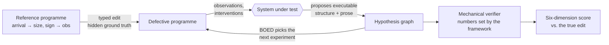

# sciagent

**Can an LLM do science when the right answer isn't in its vocabulary?**
A benchmark for LLM research agents that measures this, and never takes the
model's word for it.

Most "AI scientist" evaluations grade a system against a label or a human
rubric. sciagent grades it against **the exact structural change that was made
to the world**. Every environment is an executable generative programme. A
scenario applies a typed edit to it (a new causal dependency, a hidden latent
regime, a changed distribution family), and the system under test must work
out which edit was made by running experiments, maintaining a hypothesis graph
and proposing executable structure. Its diagnosis is scored as a **distance in
edit space**, and five other ways besides. Nobody writes the answer key; the
answer is the edit.

> **Research question.** Once conventional statistics has detected that the
> current model space is inadequate, does an LLM-guided system propose useful
> executable structure *more effectively* than retrieval, symbolic search and
> fixed-expansion baselines?

## Headline result

I ran the full preregistered experiment matrix: **1,120 investigations** across
seven systems and twelve scenarios, with Claude as the proposer.

1. **Detection works.** When the truth lies outside the model library
   (scenario S11), the posterior-predictive probe flags inadequacy on **85%**
   of runs, with a pooled false-positive rate of **3.1%** (5/160) on the
   in-library scenarios.
2. **On the preregistered contrast, the LLM system and retrieval tie exactly.**
   The hybrid LLM system (V7) and the retrieval baseline (B4) both score
   **0.6970** on intervention-response similarity: paired difference
   **0.0000 [0.0000, 0.0000]**, n = 17. The strict test (did any proposal land
   closer to the truth than the library itself?) also ties, with V7 and the
   random-structure comparator B6 both at 1.0000.
3. **The framework then showed the tie was forced.** An exact tie is evidence in
   itself, so I audited it against the recorded campaign and found two walls
   that make S11's second stage **unwinnable for any system**:
   - **A vocabulary wall.** The agent's proposal menu cannot express S11's
     true mechanism (event *size* driving *arrival rate*). This follows in closed
     form from the distance metric: every expressible proposal sits at
     structural distance ≥ 1.5 from the truth, while the always-entertained null
     sits at 1.0. The truth is reachable, at 0.571, only through the
     environment's full grammar.
   - **An evidence wall.** The one diagnostic carrying S11's signature
     (`size_gap_correlation`) was *available* in all 112 recorded LLM briefs and
     *observed* in none. Bayesian experimental design picks experiments by
     information gain over the hypotheses currently entertained, and no
     entertained hypothesis made that query informative.

   Within both walls the LLM behaved sensibly: its 112 proposals were coherent
   regime-switching, Hawkes-variant and size-mixture structures, each with a
   sound diagnostic rationale.

**So the research question is open, not answered "no".** Most benchmarks would
have reported "LLM ≈ retrieval" and stopped. This one is strict enough to show
when an instrument *cannot* tell two systems apart, which is only possible
because ground truth is a structure rather than a label. Each instrument flaw
the campaign exposed is recorded with its evidence in
[`docs/DECISIONS.md`](docs/DECISIONS.md).

## How it works



- **Ground truth is a structure, not a label.** A defect is a `frozenset` of
  edits from a versioned `EditGrammar`, so "correct diagnosis" is a distance in
  edit space and partial credit has a precise meaning.
- **The prior is derived, not fitted.** `EditGrammar.code_length` is a prefix
  code over the edit space that satisfies Kraft's inequality, fixed before any
  scenario existed. The complexity prior `p(D) ∝ 2^(−L(D))` comes from the
  representation, never from benchmark frequencies.
- **Out-of-library is mechanical.** The point-process environment declares two
  grammars; a scenario is out-of-library exactly when its true edit lies in
  `edit_grammar() \ agent_grammar()`. No annotator decides it.
- **The framework writes numbers; agents write structure.** No code path
  reachable from an agent can set a plausibility, posterior, metric or score,
  and runtime assertions enforce it.

**Scored six ways, never collapsed:** D1 structural edit recovery, D2 held-out
predictive adequacy, D3 intervention-response similarity, D4 explanatory
coverage, D5 enabled experiment value, D6 complexity. A structurally different
but interventionally equivalent explanation counts as a success on D3. There is
no total and no leaderboard rank.

| System | Description |
|---|---|
| **V7** | Hybrid: an LLM proposes and revises hypotheses, BOED selects experiments |
| V3 / V4 | LLM with raw history vs. LLM with the hypothesis graph (ablation) |
| V1 | BOED only, over the closed hypothesis set |
| **B4** | Retrieval from a fixed mechanism library: the preregistered primary comparator, chosen as the one most likely to *deflate* the LLM claim |
| B5 | Symbolic beam search over the agent grammar |
| B1 | Posterior-predictive detector only: a floor for detection that proposes nothing |

## Environments

**`pointproc`** is a marked point process (`arrival → {size, sign} → obs`) into
which four mechanisms can be edited: Hawkes self-excitation, latent regime
switching, deterministic seasonality and an independent Poisson mixture. All
four are calibrated to the same operating point (mean rate 1.0, inter-arrival
dispersion 3.5), so **no single statistic separates them** and telling them
apart takes a plan of at least three stages. Twelve scenarios sit on it,
including **S11**, whose truth is outside the agent's vocabulary by
construction, and **S12**, a garden path where a censoring nuisance makes the
first two diagnostics point confidently at the wrong mechanism.

**`qtm`** ingests a byte-pinned catalogue of **real Southern California
seismicity** behind the same event-log interface, so the framework can run on
found data.

## Quickstart

```sh
uv sync
uv run pytest -n 4 --dist loadfile
```

Apply a defect to the reference programme, execute it, and measure it in edit
space:

```python
import numpy as np

from environments.pointproc import edit_grammar, mechanism_defect, reference_program
from sciagent.core.types import ComponentId, Seed

program = reference_program()
grammar = edit_grammar()

defect = mechanism_defect("hawkes")
defective = grammar.apply(program, defect)

log = defective.execute(Seed(20260801), n_events=2000)
gaps = np.diff(log.values[ComponentId("arrival")])
print("dispersion:", round(float(gaps.var() / gaps.mean() ** 2), 3))
print("code_length:", grammar.code_length(defect), "bits")
print(
    "distance to seasonality:",
    round(grammar.distance(defect, mechanism_defect("seasonality")), 3),
)
print("collateral:", sorted(defective.descendants(ComponentId("arrival"))))
```

```
dispersion: 3.273
code_length: 24.0 bits
distance to seasonality: 1.5
collateral: ['arrival', 'obs', 'sign', 'size']
```

Same seed, same bytes, on every run.

## Engineering

Research code held to the standard of production infrastructure: a result that
can't be reproduced to the byte can't be trusted as a result.

- **Bit-exact determinism.** Same seed + config + version ⇒ byte-identical
  output. All randomness flows through explicitly passed seeded generators, and
  an AST-level test forbids global RNG use.
- **Append-only, content-addressed registry.** Every result is keyed by a hash
  of (environment version, config, data version, metric version, seed); the
  store has no update or delete path. A resumed campaign skips recorded cells,
  and a changed metric gets a new address instead of overwriting the old one.
- **Replayable LLM calls.** Models are reached through one provider layer, and
  recorded calls are registered by hash, so a campaign replays offline with no
  network access. (The campaign ledgers and transcripts are local artefacts and
  are not in this repository.)
- **49 acceptance gates as the contract.** Each criterion in the
  [spec](docs/SPEC.md) maps to a named test class (`TestA1` … `TestA49`), and
  `scripts/status.py` derives build state from them. Over 1,000 test functions
  in all, including property-based tests with Hypothesis.
- **Preregistration.** Comparators, conditioning events and success criteria
  were fixed in the spec *before* the systems they grade existed. The
  evaluation apparatus was built and validated before any LLM code, so weak
  agent performance can't be confounded with an immature framework.
- **Strict typing.** `mypy --strict` clean across 161 source files, frozen
  dataclasses for value types, no mutable global state, no I/O in `core/`.
- **About 29k lines of source and 34k lines of tests.** The `sciagent` package
  is domain-independent and never imports from `environments`; a test enforces
  it.

Built with [Claude Code](https://claude.com/claude-code) as a pair programmer.
The hooks and review agents in [`.claude/`](.claude) enforce the invariants
above on every edit.

## Layout

```
src/sciagent/         domain-independent framework; never imports environments
  core/               programmes, edits, grammar, prefix code, distance
  registry/           append-only content-addressed store
  hypothesis/         hypothesis graph, falsifiability and duplicate validation
  inference/          empirical posterior engines, PPC, entropy
  experiments/        experiment DSL, executor, BOED
  systems/            V7 hybrid, LLM providers, V3/V4 ablation, baselines
  verify/             mechanical claim checks: logical, numerical, statistical, causal
  eval/               scenarios, six-dimension scoring, campaign, report
src/environments/
  pointproc/          simulated marked point process
  qtm/                real seismicity catalogue, found-data ingestion
scripts/              status, calibration, confounding check, matrix report
tests/acceptance/     A1–A49, one module per subsystem
docs/                 SPEC.md (frozen), DECISIONS.md, BACKLOG.md, SCALE-UP.md
```

- [`docs/SPEC.md`](docs/SPEC.md): the frozen design, including research
  questions, scenarios, scoring, experiment matrix and acceptance criteria.
- [`docs/DECISIONS.md`](docs/DECISIONS.md): every spec ambiguity, measured
  number and abandoned approach, dated with its evidence. It is large; search
  it rather than reading it end to end.
- [`docs/SCALE-UP.md`](docs/SCALE-UP.md): the interface changes needed to go
  from this 12-scenario slice to a 104-scenario benchmark.

## Development

```sh
uv sync
uv run pytest -n 4 --dist loadfile        # simulation-bound: minutes, not seconds
uv run mypy                               # strict; configured in pyproject
uv run ruff format . && uv run ruff check --fix .
uv run python scripts/status.py --run     # verify gates by execution
```

## Data

The `qtm` environment uses the QTM catalogue: Ross, Z. E., Trugman, D. T.,
Hauksson, E. & Shearer, P. M. (2019), *Searching for hidden earthquakes in
Southern California*, Science 364, 767–771. Data from the Southern California
Earthquake Data Center (SCEDC, doi:10.7909/C3WD3xH1) and the Southern
California Seismic Network (SCSN, doi:10.7914/SN/CI). The catalogue is not
redistributed here; `scripts/fetch_qtm.py` downloads it from SCEDC and checks it
against pinned SHA-256 checksums.

## Licence

[Apache 2.0](LICENSE) © Ebinezer Rajaram
